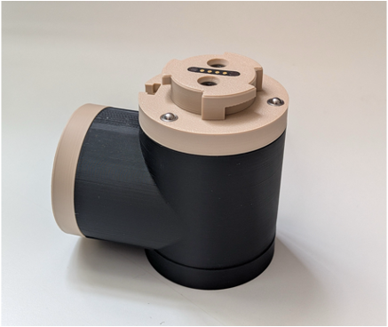

# MIR 

Modular Intelligent Robot

> **MIR** is an open-source modular robotics platform for education, research and experimentation.

Designed around interchangeable hardware modules, MIR makes it possible to build different robots while sharing a common hardware and software architecture. 
The platform is compatible with the LeRobot ecosystem for robot learning, while remaining suitable for more traditional robotics applications such as kinematics, control, teleoperation, perception and navigation.

  

